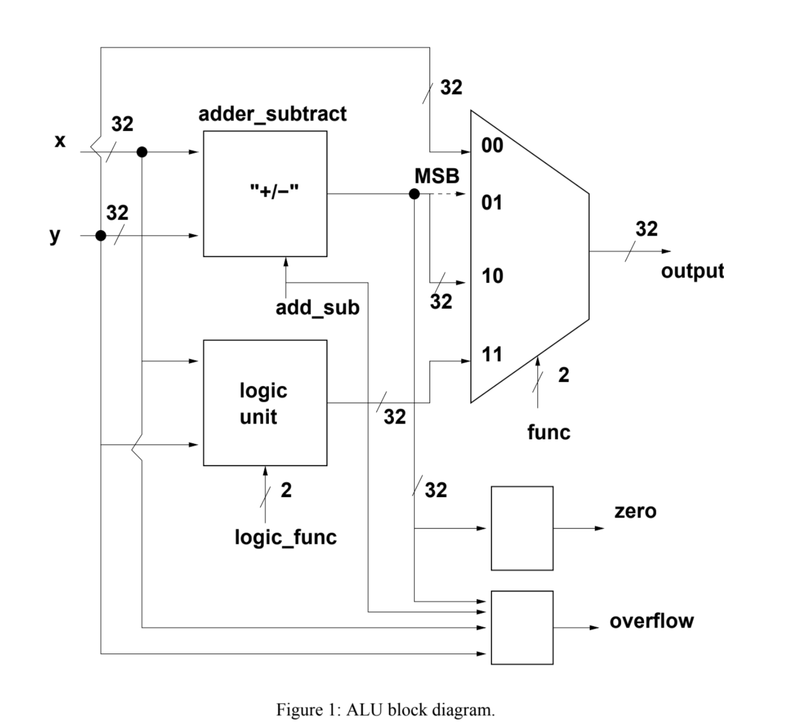

# CPU Design

Comprehensive CPU design in VHDL, featuring control unit, instruction memory, register files, data memory, and ALU. Ideal for learning and implementing CPU architecture by students, hobbyists, and professional

# ALU

The ALU has two 32-bit input operands (ports x and y) and a 32-bit output port. It utilizes control inputs func and logic_func to determine arithmetic and logical operations. The func control selects operations like load upper immediate, set less than zero, addition/subtraction, or logical operations, while logic_func controls logical operations (AND, OR, XOR, NOR). An additional control signal, add_sub, distinguishes between addition and subtraction, with arithmetic performed in 32-bit two's complement notation. See Figure 1 for a visual representation of the ALU's operations.



## MSB of adder

The Most Significant Bit (MSB) is determined in the context of the "slt" (set less than zero) instruction. This instruction sets a specified register to 1 if x < y and 0 otherwise. The condition x < y is checked by performing the operation x - y. The sign bit of the output of the subtract operation (adder_subtract unit) is padded with 0s to form a 32-bit number.

-- MSB OPERATIONS
msbsub <= std_logic_vector(unsigned(x) - unsigned(y));
msb <= (0 => msbsub(31), others => '0');

## Output of adder

## Output of logic Unit

# PC Entity

## Entity Declaration

```vhdl
entity pc is
    port(
        pc_in  : in  std_logic_vector(31 downto 0);  -- Input: New value for Program Counter
        reset  : in  std_logic;                       -- Input: Reset signal
        clk    : in  std_logic;                       -- Input: Clock signal
        pc_out : out std_logic_vector(31 downto 0)   -- Output: Current value of Program Counter
    );
end pc;
```

The `pc` entity represents a basic Program Counter (PC) module in a digital system. It has inputs for a new PC value (`pc_in`), a reset signal (`reset`), and a clock signal (`clk`). The current PC value is available as an output (`pc_out`).

# Registers

# Next Address Unit

# Control Unit
